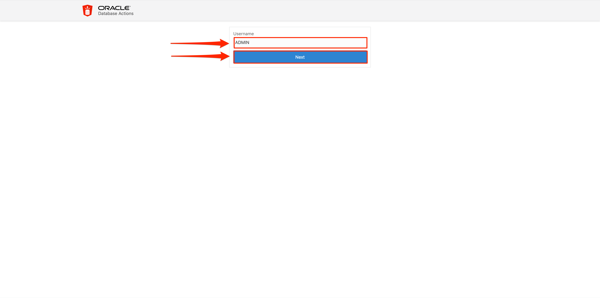
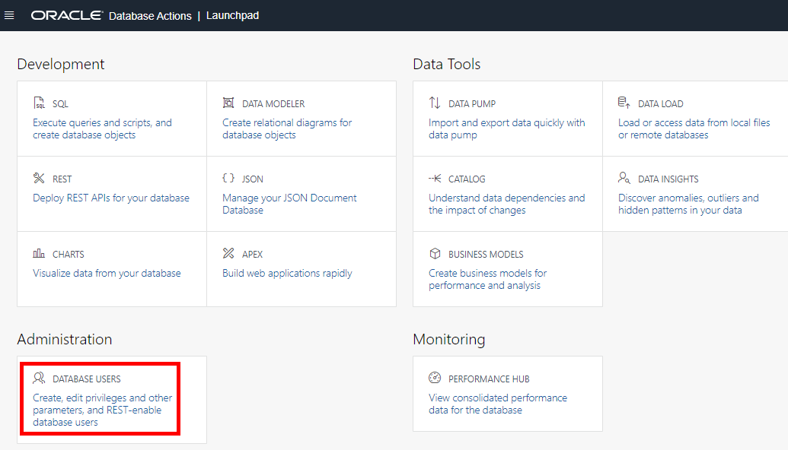
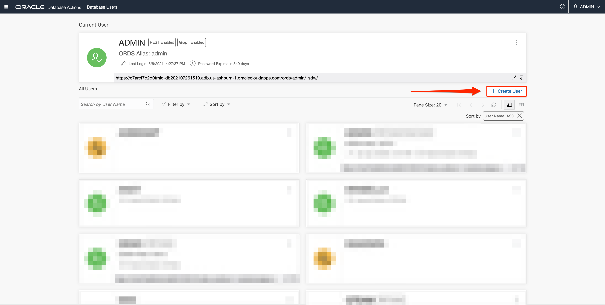
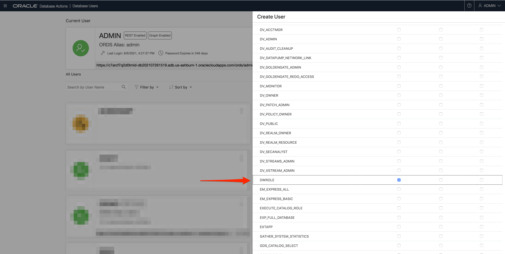
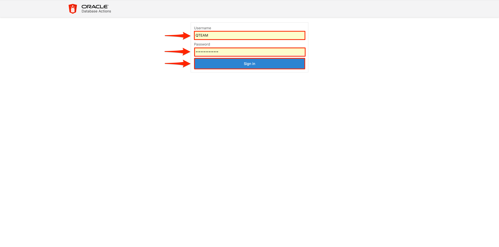
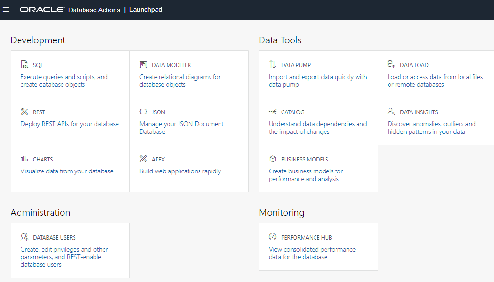

# How do I create a database user using Data Tools?

Duration: 5 minutes

When you create a new data warehouse, you automatically get an account called ADMIN, your super administrator user. You will want to keep your data warehouse data completely separate from the administration processes in the real world. Therefore, you will need to know how to create separate new users and grant them access to your data warehouse. This section will guide you through this process using the "New User" wizard within the SQL Worksheet (one of the built-in tools in Autonomous Data Warehouse).

## Create new database users

1. On the Oracle Cloud Console, make sure you are in the region where your ADB instance is provisioned. Click on the navigation menu, search **Oracle Database**, and click on **Autonomous Database**.

2. From the compartment drop-down menu, select the **Compartment** where your Oracle Autonomous Database resource is provisioned. If there were a long list of databases, you could filter the list by the **State** of the databases, and sort by **Workload Type**.

3. From the databases displayed, click **Display Name** of the database you wish to add a cloud storage connection to navigate to the **Details** page of your Autonomous Database and click the **Database Actions** button.

    

4. In the Database Action login form, enter ADMIN for the username and click **Next**. Enter the ADMIN password you provided when creating your Autonomous Data Warehouse on the next form.

    

5. On the Database Actions launchpad page, under Administration, click the **DATABASE USERS** card.

    

6. You can see that your ADMIN user is listed as the current user. On the right-hand side, click the **+ Create User** button.

    

7. The **Create User** form will appear on the right-hand side of your browser window. Provide the details below to complete the form:

    - **User Name:** Provide a new user name in upper case.
    - **Password:** Create a strong password.

        > **Note:** Rules for User Passwords - Autonomous Data Warehouse requires strong passwords. User passwords must meet the following default password complexity rules:

        - Password must be between 12 and 30 characters long
        - Must include at least one uppercase letter, one lowercase letter, and one numeric character
        - Limit passwords to a maximum of 30 characters
        - Cannot contain the username
        - Cannot be one of the last four passwords used for the same username
        - Cannot contain the double quote (") character

        More information is available in the documentation about password rules and how to create your own password rules. See here: [Create Users on Autonomous Database](https://docs.oracle.com/en/cloud/paas/autonomous-database/adbsa/manage-users-create.html#GUID-B5846072-995B-4B81-BDCB-AF530BC42847)

    - **Graph:** Leave the Graph button turned **off**. Turn it on if you want to access the Graph for this user.
    - **OML:** Leave the OML button turned **off**. Turn it on if you want to access Oracle Machine Learning for this user.
    - **Web Access:** Toggle the Web Access button to **on**
    - **Web access advanced features:** Expand the Web access advanced features
        - **Authorization required:** Leave the Authorization required toggle button **on**
        - **REST Alias:** Accept the default alias, which is automatically set to your username. This allows the user access to our new data warehouse using the Database Actions tools.
    - **Quota on tablespace Data:** Select **UNLIMITED** from the drop-down menu
    - **Password Expired:** Leave the Password Expired toggle button as **off**. This toggle button controls whether the user will be prompted to change their password when they next log in.
    - **Account is Locked:** Leave the Account is Locked toggle button **off**. 

8. Let's examine the form you just filled. It should look like this:

    

9.  Click on the **Granted Roles** banner at the top of the form. Notice that two roles have already been automatically assigned: **CONNECT** and **RESOURCE**. Add a new role **DWROLE** by checking the box for DWROLE under the Granted column.

    

10. Finally, click the **Create User** button at the bottom of the form to create the new database user.

11. Let's verify if you can access the database as a new user. TYou need to log into the database as the new user to do that. Find the card for the user you created under All users and click on the upward-pointing arrow at the bottom of the card.

    

12. Enter the username and password you provided when you created this user and click on **Sign in**. This will launch the Database Actions Launchpad page.

    

    

    Congratulations! Now you have connected to your Autonomous Data Warehouse with your new user.

## Learn More

- See the documentation on [Managing Users on Autonomous Database](https://docs.oracle.com/en/cloud/paas/autonomous-database/adbsa/manage.html#GUID-AD7ACC07-AAF7-482A-8845-9C726B1BA86D). This topic describes administration tasks for managing users on Autonomous Database.
